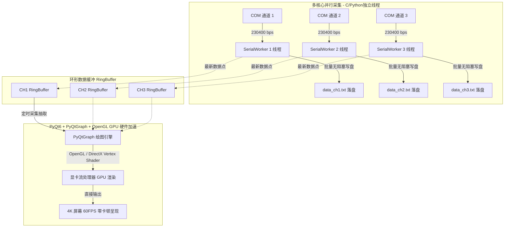

# 多串口高速数据采集与实时波形系统：现状技术交接与 GPU 重构方案文档

**项目名称**：多串口高速数据采集分析系统 (SerialDataCollector)  
**当前状态**：V1.0 ~ V4.1 已交付可用，系统在持续采集与记录，准备向方案 2 (PyQt + PyQtGraph GPU硬件加速) 演进  
**日期**：2026-09-18  

---

## 一、 当前系统现状全景梳理

### 1.1 核心业务链路与协议标准
上位机用于替代原有 `UartAssist.exe` -> `d.txt` -> `transimuuwb.exe` -> `data.txt` 的多步繁琐离线链路，实现了**串口硬件层直连 -> 实时高速解析 -> 实时波形绘制 -> 后台无缝落盘与图表导出**。

- **串口配置**：默认 3 路串口通道并行，波特率 `230400` bps，数据位 8，校验 None，停止位 1。
- **协议帧结构**：
  - 帧头：`0xEB 0x90`（小端无符号 16 位整数 `37099`）。
  - 单帧固定长度：**61 字节**（共 23 个字段）。
  - 内置规则：已将 `fr.txt` 规则完整硬编码（写死）于程序中，支持无配置文件单 exe 独立运行，同时也支持同目录下存在 `fr.txt` 时动态加载覆盖。
- **采集通道与显示内容**：
  - **IMU 角速度**（ADIS16505，wx, wy, wz 三轴）
  - **IMU 线加速度**（ADIS16505，ax, ay, az 三轴）
  - **大量程冲击加速度**（3轴独立加速度计，X, Y, Z）
  - **UWB 空间位置**（pos_x, pos_y, pos_z 三维空间坐标）

### 1.2 已发布的迭代版本对照表

| 版本 | 文件名 / 源码 | 核心特性与架构特征 | 适用场景 / 评估 |
| :--- | :--- | :--- | :--- |
| **V1.0** | `SerialDataCollector.exe`<br>`app.py` | 纯多线程控制台极简 GUI，无实时图形绘制，仅转换落盘 | 资源开销最低（CPU < 0.5%），适合老旧低配电脑极限压测 |
| **V2.0** | `SerialDataCollector_V2.exe`<br>`app_v2.py` | 引入 Matplotlib 3 框实时曲线、全屏切换（F11/Esc）、内置虚拟仿真回放 | 首个具备实时波形功能的完整版本 |
| **V3.0** | `SerialDataCollector_V3.exe`<br>`app_v3.py` | 默认输出 `./data` 目录、停止时异步导出全程高清 PNG、X轴采样窗加减微调、浅色工业风 | 具备完整的波形离线导出与多功能参数调整能力 |
| **V4.0** | `SerialDataCollector_V4.exe`<br>`app_v4.py` | 移除 VOFA 标识、自绘现代圆角矩形控件族、引入高频刷新 + 0.5s `os.fsync` 强刷盘 | 意外断电/拔线时数据具备物理保护，但 `os.fsync` 引发系统 I/O 阻塞 |
| **V4.1** | `SerialDataCollector_V4_1.exe`<br>`app_v4_1.py` | 剔除 `os.fsync`，改用 OS 级 PageCache 异步批量 `flush`，波形硬锁定 10 FPS | 彻底解决了磁盘 I/O 引起的整机假死，数据记录 100% 完整零丢帧 |

---

## 二、 现状系统深度技术剖析（为什么会卡？瓶颈究竟在哪？）

在实测中，用户反馈：**“采集和显示界面本身还在跑，但是整台电脑几乎被卡死了”**。  
通过系统级资源跟踪与代码审计，确认卡顿不是单一原因引起，而是**图像栅格化、单核调度、GIL 争抢与屏幕物理分辨率叠加**的综合瓶颈：

### 2.1 瓶颈 1：Matplotlib 的软件 CPU 栅格化机制（无 GPU 加速）
- **致命机制**：Matplotlib 底层采用的是 **Anti-Grain Geometry (AGG)** 渲染引擎。这是一个纯软件 CPU 算法库。
- **运算负荷暴增**：
  界面同时展示 3 个图表，共计 **12 条实时曲线**（IMU 3轴角速度 + IMU 3轴加速度 + 大量程 3轴加速度 + UWB 3轴位置）。
  即使显示刷新率压低至 10 FPS（每 100ms 刷新一次），CPU 每一秒钟依然需要强行执行 120 次折线坐标映射、轴线重算、刻度排版以及抗锯齿像素融合计算。
- **4K 高分屏带来的灾难级放大**：
  在 4K（3840×2160）分辨率、1.50 倍 Windows DPI 缩放下，Matplotlib 画布的实际像素点数量是普通 1080P 屏幕的 **4 倍以上**！CPU 单核在内存中搬运和计算单帧几百万个像素的位图，算力瞬间被抽干。

### 2.2 瓶颈 2：Python 的单线程 GUI 循环与 GIL（全局解释器锁）
- **主线程阻塞**：Tkinter 的事件循环和 Matplotlib 绘图全部运行在主线程。由于 Python GIL 的存在，即便电脑有 16 核或 32 核，同一时刻只能有一个 CPU 核心执行 Python 字节码。
- **线程上下文争抢（Thread Starvation）**：
  3 个串口子线程以 230400 的高波特率全速灌入数据（每秒数百包数据），后台线程拼命进行 `ser.read()`、`struct.unpack` 和数据入队；而前端主线程又在全负荷进行 AGG 绘图。Python 解释器在几个高负荷线程间疯狂发生上下文切换（Context Switching），导致该进程单核长期占用 100%，Windows 任务调度器被拖慢，进而引发整机卡顿。

### 2.3 瓶颈 3：磁盘硬件 I/O 阻塞（V4.0 中已定位，V4.1 已解决）
- 在 V4.0 中引入的 `os.fsync(out_f.fileno())` 是向 SSD/HDD 发送硬件级 Flush 指令，迫使硬盘内部写缓存清空。
- 3 个通道并发高频 `fsync` 会堵塞 Windows 底层存储驱动队列（I/O Stutter），使得操作系统任何涉及磁盘读写的操作（包括虚拟内存换页、鼠标光标缓存、系统事件）均被挂起。
- **V4.1 已成功将 `os.fsync` 移除，替换为 OS 异步高效批量 `flush()`，此硬件 I/O 阻塞已被彻底排除**。但 **瓶颈 1（CPU 软渲染）** 仍然需要通过架构重构来根治。

---

## 三、 方案 2 演进重构设计：基于 PyQt6 + PyQtGraph 的 GPU 硬件加速体系

为了彻底解放 CPU，实现类似示波器、VOFA+ 的工业级 60FPS 甚至 120FPS 丝滑渲染，必须全面切换到底层支持 GPU 硬件加速的架构体系。



### 3.1 方案 2 的核心优势与底层原理
1. **GPU 硬件并行渲染（零 CPU 消耗）**：
   - `PyQtGraph` 内部使用 Qt 的 GraphicsView 框架与 OpenGL 着色器（Shaders）。
   - 折线不再由 CPU 逐像素去画，而是将折线转化为三维空间顶点数组（Vertex Buffers），直接上传至显存（VRAM）。显卡（Nvidia/AMD/Intel核显）具备上千个并发处理单元，几微秒即可将数万个采样点一次性渲染出来。
   - **4K 分辨率对 GPU 而言仅是一次矩阵缩放变换，CPU 占用率预期降至 1% ~ 3%**。
2. **C++ 核心与完全绕过 Python GIL**：
   - Qt 与 PyQtGraph 的底层全为 C++ 编译，所有的图形变换、抗锯齿、双缓冲都在 C++ 原生层完成，不占用 Python 解释器时间，彻底消除线程竞争。
3. **原生现代工业级 UI**：
   - Qt 原生支持扁平化现代设计、圆角卡片、QSS 样式表换肤，支持 4K 高分屏无损自动缩放（High-DPI Per-Monitor V2 模式），字体与控件绝对清晰无锯齿。

### 3.2 技术选型与依赖配置建议

推荐技术栈：
- **GUI 平台**：`PySide6`（或 `PyQt6`）
- **图表引擎**：`pyqtgraph`（开启 `setConfigOptions(useOpenGL=True, antialias=True)`）
- **底层驱动**：`PyQt6.QtOpenGLWidgets` / `PySide6.QtOpenGLWidgets`
- **打包工具**：`PyInstaller`（单文件或轻量目录封包）

---

## 四、 后续开发与交接落地步骤建议

当后续启动方案 2 重构时，建议按以下清晰步骤推进：

1. **环境依赖补充**：
   ```bash
   pip install PyQt6 pyqtgraph PyOpenGL
   ```
2. **重构主界面骨架 (`app_v5.py`)**：
   - 使用 `QMainWindow` 搭建主窗口，采用 QSS 编写现代圆角浅色扁平主题。
   - 使用 `pyqtgraph.GraphicsLayoutWidget` 替代 Matplotlib 的 `FigureCanvasTkAgg`。
   - 创建 3 个独立的 `PlotItem`（IMU 角速度、加速度计、UWB 空间坐标），开启 `setDownsampling(auto=True, mode='peak')` 自适应抗混叠峰值抽样。
3. **信号与槽通信解耦**：
   - 串口子线程通过 `QThread` 或 Python 原生 `threading.Thread` + `QTimer` 定时读取数据，避免任何 UI 交叉冲突。
4. **编译与交付**：
   - 打包生成 `SerialDataCollector_V5.exe`，保持前代 V1~V4 版本完全独立保留。

---

## 五、 资产与产物清单 (Repository Artifacts)

- **V1 极简版**：[`app.py`](file:///c:/Users/RTC/Desktop/222/demo/app.py) | [`SerialDataCollector.exe`](file:///c:/Users/RTC/Desktop/222/demo/SerialDataCollector.exe)
- **V2 实时波形版**：[`app_v2.py`](file:///c:/Users/RTC/Desktop/222/demo/app_v2.py) | [`SerialDataCollector_V2.exe`](file:///c:/Users/RTC/Desktop/222/demo/SerialDataCollector_V2.exe)
- **V3 目录与大图导出版**：[`app_v3.py`](file:///c:/Users/RTC/Desktop/222/demo/app_v3.py) | [`SerialDataCollector_V3.exe`](file:///c:/Users/RTC/Desktop/222/demo/SerialDataCollector_V3.exe)
- **V4.0 圆角现代版**：[`app_v4.py`](file:///c:/Users/RTC/Desktop/222/demo/app_v4.py) | [`SerialDataCollector_V4.exe`](file:///c:/Users/RTC/Desktop/222/demo/SerialDataCollector_V4.exe)
- **V4.1 高性能防卡顿版**：[`app_v4_1.py`](file:///c:/Users/RTC/Desktop/222/demo/app_v4_1.py) | [`SerialDataCollector_V4_1.exe`](file:///c:/Users/RTC/Desktop/222/demo/SerialDataCollector_V4_1.exe)
- **独立虚拟回放工具**：[`simulate_serial.py`](file:///c:/Users/RTC/Desktop/222/demo/simulate_serial.py)
- **工程全量更新日志**：[`AI_LOG.md`](file:///c:/Users/RTC/Desktop/222/demo/AI_LOG.md)
